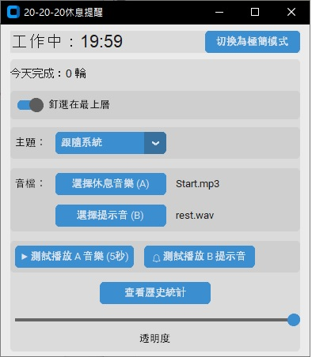

# TwentyTimer 

##  專案簡介
**TwentyTimer** 是一個依照 **20-20-20 原則**設計的桌面小工具：  
- 每工作 20 分鐘  
- 看向 20 英尺（約 6 公尺）外  
- 休息 20 秒  

程式會自動提醒，幫助使用者養成健康的用眼習慣，減少眼睛疲勞。  

---

##  版本

本專案目前有兩個各自獨立的原生實作，設定與統計檔案格式共用，詳見 [`mac/SPEC.md`](mac/SPEC.md)：

| 目錄 | 平台 | 技術 | 說明 |
|---|---|---|---|
| [`mac/`](mac) | macOS | Swift + SwiftUI | macOS 原生版，選單列常駐 |
| [`windows/`](windows) | Windows | C# + WinForms | Windows 原生版，系統匣常駐，`mac/` 版的移植 |

### 設計重點

- **移除背景音樂**。持續 30 秒的音樂是用最吵的方式解決一個只需要 1 秒的需求，改成休息結束時的短提示音（音量可放大到 300% 以蓋過背景音樂）。
- **休息結束不自動回到工作**，會停在「休息完成」等你按下繼續。這樣離座回來一定看得到狀態，也不會空轉浪費一輪。
- **閒置門檻從 10 秒改為 2 分鐘**。10 秒太敏感，安靜看文件時會被誤判。
- **不做全螢幕遮罩**，改用右上角低調的小面板，在辦公室不顯眼。
- **開會時自動延後**：偵測到有 App 正在使用麥克風就先不打擾。
- **閒置偵測不需要任何系統權限**（`mac/` 版用 CGEventSource，`windows/` 版用 `GetLastInputInfo`，都不需要權限）。

---

##  功能特色
-  **倒數計時**：20 分鐘工作 → 30 秒休息循環  
-  **聲音提醒**：開始與結束都有提示音，支援自選音效檔  
-  **自動暫停**：閒置一段時間後計時會自動暫停  
-  **統計功能**：自動紀錄每天完成的循環次數，可查看歷史紀錄  
-  **介面自訂**：支援主題切換等設定，操作更彈性  


---

##  使用方式

### macOS 版

```bash
cd mac
./build.sh
open build/TwentyTimer.app
```

只需要 Command Line Tools，不需要完整的 Xcode。
啟動後常駐在選單列，詳見 [`mac/README.md`](mac/README.md)。

### Windows 原生版

```powershell
cd windows
.\build.ps1
.\build\TwentyTimer.exe
```

只需要 [.NET 8 SDK](https://dotnet.microsoft.com/download)，不需要 Visual Studio。
啟動後常駐在系統匣，詳見 [`windows/README.md`](windows/README.md)。


---

##  專案範例




##  未來改進方向

* ~~Windows 版：比照 macOS 版重新設計提醒方式~~ —— 已完成，見 [`windows/`](windows)
* macOS 版／Windows 原生版：全域快捷鍵、螢幕分享偵測

---

##  授權

此專案以 **MIT License** 授權，歡迎自由使用與修改。
